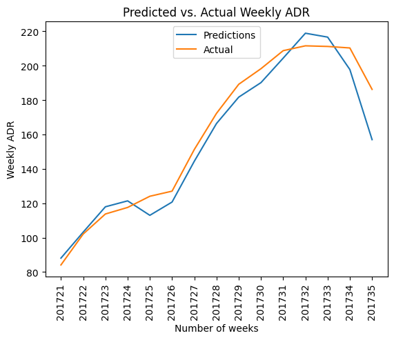
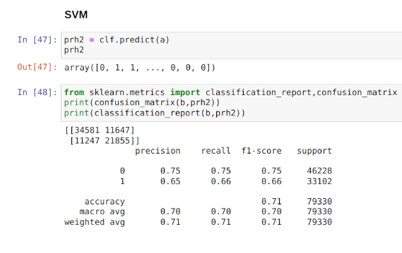
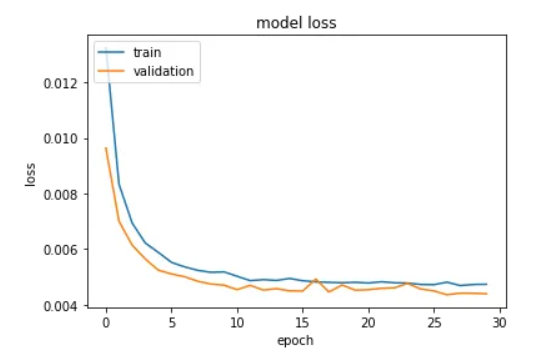

[Home](https://mgcodesandstats.github.io/) |
[Portfolio](https://mgcodesandstats.github.io/articles) |
[GitHub](https://github.com/mgcodesandstats) |
[LinkedIn](https://www.linkedin.com/in/michaeljgrogan/) |
[Stack Overflow](https://stats.stackexchange.com/users/137066/michael-grogan) |
[Terms](https://mgcodesandstats.github.io/terms/) |
[E-mail](mailto:contact@michael-grogan.com)

# Predicting Hotel Cancellations and ADR with Machine Learning

The purpose of this project is to predict hotel cancellations and ADR (average daily rate) values for two separate Portuguese hotels (H1 and H2). Included in the GitHub repository are the datasets and notebooks for all models run.

The original datasets and research by Antonio et al. can be found here: [Hotel Booking Demand Datasets (2019)](https://www.sciencedirect.com/science/article/pii/S2352340918315191). All other relevant references have been cited in the below articles.

## Articles

### [Forecasting Hotel Revenue: Predicting ADR Fluctuations with ARIMA](https://www.michael-grogan.com/articles/forecasting-adr-arima)

Average daily rate represents the average rate per day paid by a staying customer at a hotel. This is an important metric for a hotel, as it represents the overall profitability of each customer. In this example, auto_arima is used in Python to forecast the average daily rate over time for a hotel chain.

### [Handling Imbalanced Classification Data: Predicting Hotel Cancellations Using Support Vector Machines](https://www.michael-grogan.com/articles/hotel-cancellations-svm)

When attempting to build a classification algorithm, one must often contend with the issue of an unbalanced dataset. An unbalanced dataset is one where there is an unequal sample size between classes, which induces significant bias into the predictions of the classifier in question. This example illustrates the use of a Support Vector Machine to classify hotel booking customers in terms of cancellation risk.

### [Regression-based neural networks: Predicting Average Daily Rates for Hotels](https://www.michael-grogan.com/articles/regression-based-neural-network)

When it comes to hotel bookings, average daily rate (ADR) is a particularly important metric. This reflects the average rate per day that a particular customer pays throughout their stay. In this particular example, a neural network is built in Keras to solve a regression problem, i.e. one where our dependent variable (y) is in interval format and we are trying to predict the quantity of y with as much accuracy as possible.

## Project Stages

### Stage 1: Data Manipulation and Feature Selection

- Used pandas to collate over **115,000** individual cancellation and ADR entries into a weekly time series format.

- Identified **lead time**, **country of origin**, **market segment**, **deposit type**, **customer type**, **required car parking spaces**, and **week of arrival** as the most important features in explaining the variation in hotel cancellations.

### Stage 2: Classification

- Trained [classification models](https://github.com/MGCodesandStats/hotel-modelling/blob/master/classification.ipynb) on the H1 dataset and tested against the H2 dataset. Used boto3 and botocore to import data from AWS S3 bucket to SageMaker.

- Used the **Explainable Boosting Classifier** by InterpretML, **KNN**, **Naive Bayes**, **Support Vector Machines**, and **XGBoost** to predict cancellations across the test set.

- SVM demonstrated the best performance overall with an f1-score accuracy of **71%**, and **66%** recall across the cancellation class.

- An ANN model was also trained in conjunction with dice_ml to identify [Diverse Counterfactual Explanations](https://github.com/MGCodesandStats/hotel-modelling/blob/master/interpretml-dice-ml.ipynb) for hotel bookings, i.e. changes in feature parameters that would cause a non-canceling customer to cancel, and vice versa.

### Stage 3: Regression

- Used regression modelling to predict **ADR (average daily rate)** across each customer.

- Trained regression models on the H1 dataset and tested against the H2 dataset.

- [Regression-based neural network with elu activation function](https://github.com/MGCodesandStats/hotel-modelling/blob/master/regression-nn-elu.ipynb) showed the best performance, with a mean absolute error of **29** compared to the mean ADR of **105** across the test set.

### Stage 4: Time Series

- Used ARIMA and LSTM models to forecast weekly ADR trends. 

- ARIMA demonstrated best results in forecasting ADR for [H1](https://github.com/MGCodesandStats/hotel-modelling/blob/master/timeseries-arima-adr-h1.ipynb) (RMSE of **10** relative to mean ADR of **160**) and [H2](https://github.com/MGCodesandStats/hotel-modelling/blob/master/timeseries-arima-adr-h2.ipynb) (RMSE of **8** relative to mean ADR of **131**).
