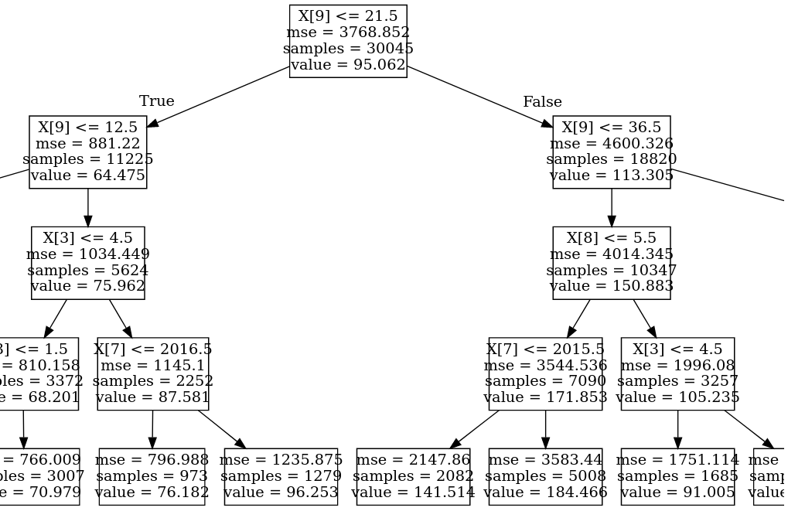

# Regression-based decision trees: Predicting Average Daily Rates for Hotels

The purpose of a decision tree is to visualise features of a model by means of a tree-like graph, and infer the importance (and lack thereof) of each feature in affecting the output variable.

The decision tree structure consists of:

- **Nodes:** Each decision tree consists of what are called **root nodes** and **decision nodes**. 
- **Branches:** Represent the outcome of each decision taken across the nodes.

In this example, a regression-based decision tree is formulated to predict ADR (average daily rate) for a hotel given certain customer attributes.

## Background

This study focuses on hotel booking analysis. When it comes to hotel bookings, **average daily rate (ADR)** is a particularly important metric. This reflects the average rate per day that a particular customer pays throughout their stay.

This analysis is based on the original study by [Antonio, Almeida, and Nunes, 2016](https://www.researchgate.net/publication/309379684_Using_Data_Science_to_Predict_Hotel_Booking_Cancellations).

Gauging ADR allows hotels to more accurately identify its most profitable customers and tailor its marketing strategies accordingly.

The chosen features that form the input for this neural network are as follows:

1. IsCanceled
2. Country of origin
3. Market segment
4. Deposit type
5. Customer type
6. Required car parking spaces
7. Arrival Date: Year
8. Arrival Date: Month
9. Arrival Date: Week Number
10. Arrival Date: Day of Month

## Data Manipulation

The interval (or continuous random variables) are defined. As two examples:

```
leadtime = train_df['LeadTime']
adr = train_df['ADR']
```

Variables with a categorical component are defined using '''cat.codes'''.

As two further examples:

```
deposittypecat=train_df.DepositType.astype("category").cat.codes
deposittypecat=pd.Series(deposittypecat)
customertypecat=train_df.CustomerType.astype("category").cat.codes
customertypecat=pd.Series(customertypecat)
```

A numpy column stack is formulated for the independent variables (both continuous and categorical):

```
x1 = np.column_stack((IsCanceled,countrycat,marketsegmentcat,deposittypecat,customertypecat,rcps,arrivaldateyear,arrivaldatemonthcat,arrivaldateweekno,arrivaldatedayofmonth))
x1 = sm.add_constant(x1, prepend=True)
```

The data is then split into training and validation sets:

```
X_train, X_val, y_train, y_val = train_test_split(x1, y1)
```

## Decision Tree Formulation

The DecisionTreeRegressor is imported using **sklearn**:

```
from sklearn.tree import DecisionTreeRegressor
```

The decision tree is fitted. Using **max_depth**, the size of the tree is determined. In this case, it is set to 4. When comparing prediction accuracy to the test data (which we will touch more on below), I found that the root mean squared error was minimised when using four trees. Using less trees risks significant information loss, while too many trees increase the risk of overfitting.

```
>>> tree_reg = DecisionTreeRegressor(max_depth=4)
>>> tree_reg.fit(X_train, y_train)

DecisionTreeRegressor(ccp_alpha=0.0, criterion='mse', max_depth=4,
                      max_features=None, max_leaf_nodes=None,
                      min_impurity_decrease=0.0, min_impurity_split=None,
                      min_samples_leaf=1, min_samples_split=2,
                      min_weight_fraction_leaf=0.0, presort='deprecated',
                      random_state=None, splitter='best')
```

Here are the generated predictions when using the validation data:

```
>>> predictions = tree_reg.predict(X_val)
>>> predictions
array([ 96.25317435, 184.46591454,  70.97877619, ...,  56.187318  ,
        53.58241309,  70.97877619])
```

In order to visualise the decision tree, a library called **graphviz** can be used.

```
>>> from sklearn.tree import export_graphviz
>>> export_graphviz(tree_reg,out_file="tree.dot")
```

A PDF of the tree visual can be generated through a terminal as follows:

```
dot -Tpdf tree.dot -o tree.pdf
```

Then, the tree image can be imported:

```
>>> import graphviz
>>> with open("tree.dot") as f:
>>>     dot_graph = f.read()

>>> graphviz.Source(dot_graph)
```

Here is a sample visual of the decision tree:



The full tree can be viewed [here](https://github.com/MGCodesandStats/hotel-modelling/blob/master/notebooks%20and%20datasets/tensorflow/tf-keras/tree.pdf).

Let's assess how the model predictions performed on the validation data both on a **mean absolute error** and **root mean squared error** basis.

```
>>> mean_absolute_error(y_val, predictions)
27.39342405758301

>>> mean_squared_error(y_val, predictions)
1531.417860233403

>>> math.sqrt(mean_squared_error(y_val, predictions))
39.13333438685493
```

## Test Data

In order to determine if the model can retain its accuracy across an unseen dataset - we will now test if the model predictions also show a similar level of accuracy across the H2 dataset.

As previously, the categorical and continuous variables are defined as such, and the values are defined appropriately:

```
atest = np.column_stack((t_IsCanceled,t_countrycat,t_marketsegmentcat,t_deposittypecat,t_customertypecat,t_rcps,t_arrivaldateyear,t_arrivaldatemonthcat,t_arrivaldateweekno,t_arrivaldatedayofmonth))
atest = sm.add_constant(atest, prepend=True)
btest = t_adr
btest=btest.values
```

Now, the decision tree is used to make predictions across the features for the test data.

```
>>> bpred = tree_reg.predict(atest)
>>> bpred
array([141.51432277, 141.51432277, 141.51432277, ..., 184.46591454,
       184.46591454, 184.46591454])
```

Now, let's assess the **mean absolute error** and **root mean squared error**.

```
>>> mean_absolute_error(btest, bpred)
41.71191007286715

>>> print('mse (sklearn): ', mean_squared_error(btest,bpred))
mse (sklearn):  3115.6311827256595

>>> math.sqrt(mean_squared_error(btest, bpred))
55.817839287504306
```

The MAE and RMSE are a bit higher than when tested across the validation data. This is in line with expectations given that this dataset is unseen. However, in terms of maximimsing accuracy, a regression-based neural network with an ELU activation function showed lower errors, with MAE at **33.56** and RMSE at **47.55**.

The article on regression-based neural networks for this example is [here](https://towardsdatascience.com/regression-based-neural-networks-with-tensorflow-v2-0-predicting-average-daily-rates-e20fffa7ac9a) if you are interested.

## Conclusion

In this example, we have seen how to:

- Construct a decision tree
- Properly configure a decision tree
- Assess model accuracy across both the validation and test sets

The datasets and notebooks for this example are available at the [MGCodesandStats GitHub repository](https://github.com/MGCodesandStats/hotel-modelling), along with further research on this topic.