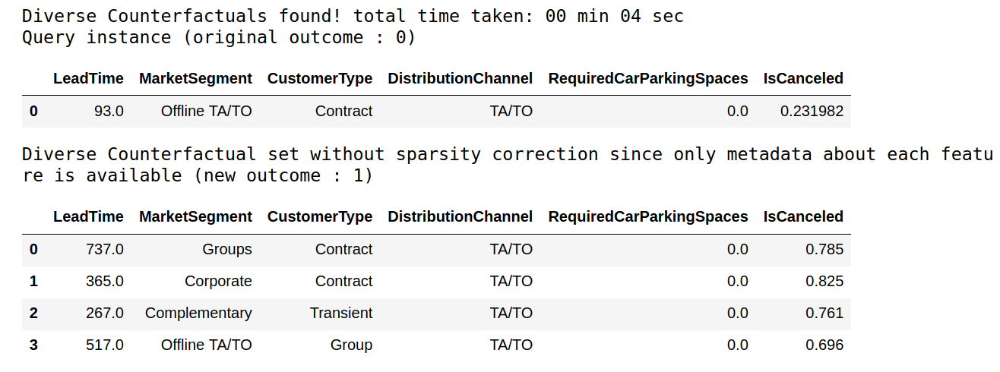
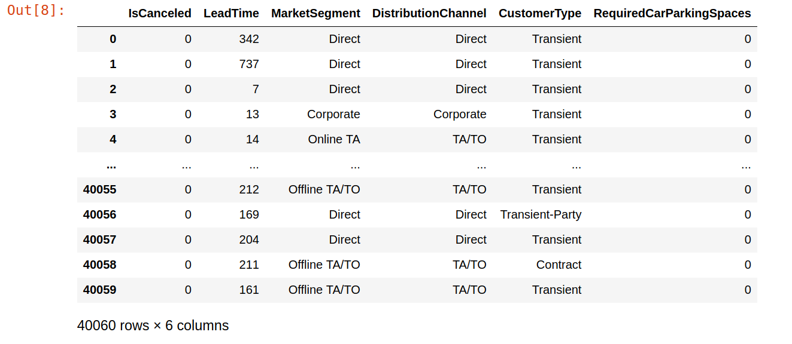
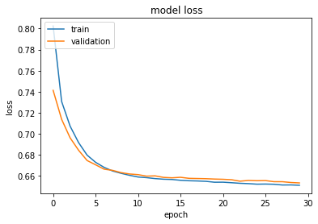
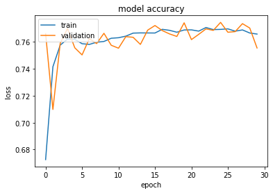
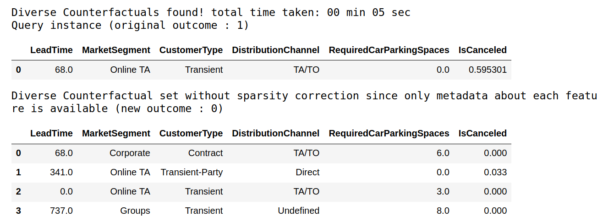

[Home](https://mgcodesandstats.github.io/) |
[GitHub](https://github.com/mgcodesandstats) |
[Speaking Engagements](https://mgcodesandstats.github.io/speaking-engagements/) |
[Terms](https://mgcodesandstats.github.io/terms/) |
[E-mail](mailto:contact@michael-grogan.com)

# DiCE: Diverse Counterfactual Explanations for Hotel Cancellations

DiCE is part of the broader InterpretML library, and is great at generating "Diverse Counterfactual Explanations" for a particular dataset.

By "Diverse Counterfactual Explanations", we mean decisions made by a model that would be influential enough to change the outcome variable.

Let's take an example.



Here is an instance where a customer did not cancel their hotel booking.

According to this particular case, the customer belongs to the market segment **Offline TA/TO**, the customer type is **Contract**, the Distribution Channel is **TA/TO** and Required Car Parking Spaces is **0**.

However, a hotel manager who is looking to minimise cancellation bookings would ideally like to identify the types of customers who **would** be likely to cancel their bookings. This is where DiCE comes in.

When looking at the counterfactual explanations above - instances where a customer **did** cancel their bookings, it is observed that:

- **Lead Time** is significantly higher across the four examples.

- Only one customer belongs to the **Offline TA/TO** market segment.

- Two of the four cancellations are still **contract** customers.

- The **distribution channel** and number of **required car parking spaces** remains the same.

The big difference between non-cancellations and cancellations (at least in this instance), appears to be lead time. The longer the period from when a customer makes a booking to when they are actually due to stay at the hotel, the more likely that such a customer will cancel their booking.

## Methodology

In order to generate the DiCE explanations above:

1. A neural network is trained using Tensorflow's Keras API in order to build the classification algorithm

2. A DiCE model is then generated from the neural network

3. A "DiCE dataset" is created using the parameters of the original dataset, i.e. encompassing the range for continuous variables while including all categories for the categorical variables.

4. A DiCE explanation instance is then generated in order to explain the result of the outcome variable.

5. Counterfactual examples are then produced (as per the example above) to explain the conditions that could potentially change the outcome variable.

On point 3, a handy feature of DiCE is the ability to discard old data while retaining the model training parameters. Such a practice is consistent with **FAIR** data principles, which stipulates that data should be **F**indable, **A**ccessible, **I**nteroperable and **R**eusable.

However, other laws can stipulate that customers have the right for their personal data to be removed, or indeed require that customer data is deleted after a certain period.

The advantage of DiCE in this instance is that it allows for retention of the model training on the relevant data, without having to retain the data itself.

Note that TensorFlow **1.15** is used with Python **3.6.9** in this instance to run DiCE and the associated models.

## Neural Network Training and DiCE Explanation Instance

Here is a sample of the dataset:



The continuous features in the dataset are defined:

```
# Dataset for training an ML model
d = dice_ml.Data(dataframe=dataset,
                 continuous_features=['LeadTime','RequiredCarParkingSpaces'],
                 outcome_name='IsCanceled')
```

The neural network model is trained across **30** epochs using the **binary_crossentropy** loss and the **adam** optimiser.

```
from tensorflow.keras.models import Sequential
from tensorflow.python.keras.layers import Dense
from tensorflow.python.keras.wrappers.scikit_learn import KerasRegressor

sess = tf.InteractiveSession()
# Generating train and test data
train, _ = d.split_data(d.normalize_data(d.one_hot_encoded_data))
X_train = train.loc[:, train.columns != 'IsCanceled']
y_train = train.loc[:, train.columns == 'IsCanceled']

# Fitting a dense neural network model
ann_model = Sequential()
ann_model.add(Dense(6, input_shape=(X_train.shape[1],), activation=tf.nn.relu))
ann_model.add(Dense(1, activation=tf.nn.sigmoid))
ann_model.compile(loss='binary_crossentropy', optimizer='adam', metrics=['accuracy'])
history=ann_model.fit(X_train, y_train, validation_split=0.20, epochs=30, verbose=0, class_weight={0:1,1:2})
history
```

Here is a plot of the model loss:



This is a plot of the training and validation accuracy:



The model is now stored as a DiCE model for explanation purposes:

```
>>> m = dice_ml.Model(model=ann_model)
>>> m
<dice_ml.model_interfaces.keras_tensorflow_model.KerasTensorFlowModel at 0x7f22fb2e0da0>
```

As previously mentioned, the features are now stored in a special format compatible with DiCE in order to generate a DiCE explanation instance:

```
new_d = dice_ml.Data(features={
                   'LeadTime':[0, 737],
                   'MarketSegment': ['Complementary', 'Corporate', 'Direct', 'Groups', 'Offline TA/TO', 'Online TA'],
                   'CustomerType': ['Contract', 'Group', 'Transient', 'Transient-Party'],
                   'DistributionChannel':['Corporate', 'Direct', 'TA/TO', 'Undefined'],
                   'RequiredCarParkingSpaces': [0, 8]},
         outcome_name='IsCanceled')
```

A DiCE explanation instance is formed:

```
>>> exp = dice_ml.Dice(new_d,m)
>>> exp

<dice_ml.dice_interfaces.dice_tensorflow1.DiceTensorFlow1 at 0x7f22fb2da630>
```

## Diverse Counterfactual Explanations

Now that the explanation instance has been formed, this can be used in order to generate counterfactual explanations.

Let's take an example of a customer with the following attributes, included in what is called a **query instance**:

```
query_instance = {'LeadTime': 68,
    'MarketSegment': 'Online TA',
    'CustomerType': 'Transient',
    'DistributionChannel': 'TA/TO',
    'RequiredCarParkingSpaces': 0}
```

Counterfactual examples are generated as follows:

```
# Generate counterfactual examples
dice_exp = exp.generate_counterfactuals(query_instance, total_CFs=4, desired_class="opposite")
# Visualize counterfactual explanation
dice_exp.visualize_as_dataframe()
```



Here, a case with an original outcome of **1**, i.e. a cancellation, is generated. It is also observed that counterexamples where a customer does not cancel their hotel booking are also generated.

Conversely, here is a query instance where the customer **did** cancel their hotel booking.

```
query_instance_2 = {'LeadTime': 93,
    'MarketSegment': 'Offline TA/TO',
    'CustomerType': 'Contract',
    'DistributionChannel': 'TA/TO',
    'RequiredCarParkingSpaces': 0}
```

Again, counterfactual examples are generated:

```
# Generate counterfactual examples
dice_exp_2 = exp.generate_counterfactuals(query_instance_2, total_CFs=4, desired_class="opposite")
# Visualize counterfactual explanation
dice_exp_2.visualize_as_dataframe()
```


These are just some examples of how counterfactual explanations can be generated.

In these instances, four counterfactual examples were produced (total_CFs=4), with the "opposite" class being of interest.

It is possible to use DiCE to generate deeper insights as regards counterfactual explanations.

For instance, consideration may be given to the **proximity** of the explanations to the original input as well as the **diversity** of those explanations, i.e. the range of suggested changes to the explanations in question. The [DiCE GitHub README](https://github.com/interpretml/DiCE) provides more explanation on these.

# Conclusion

In this article, you have seen:

- How DiCE can be used to generate counterfactual explanations
- How DiCE can retain model training without having to retain the data itself
- Modification of neural network output so as to be compatible with DiCE

Many thanks for your time, and the associated GitHub repository for this example can be found [here](https://github.com/MGCodesandStats/hotel-modelling/tree/master/notebooks%20and%20datasets/tensorflow/tf-keras).

## References

- [Antonio, Almeida, and Nunes: Using Data Science to Predict Hotel Booking Cancellations](https://www.researchgate.net/publication/309379684_Using_Data_Science_to_Predict_Hotel_Booking_Cancellations)

- [Diverse Counterfactual Explanations (DiCE) for ML](https://github.com/interpretml/DiCE)