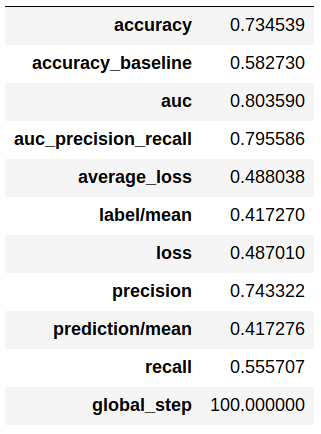
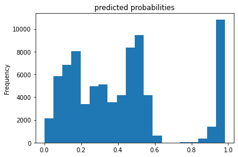
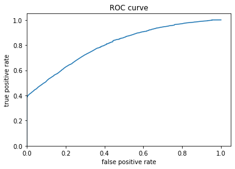
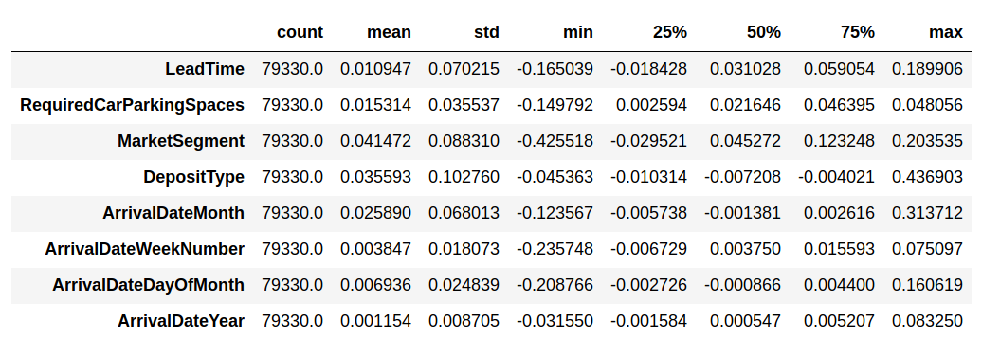
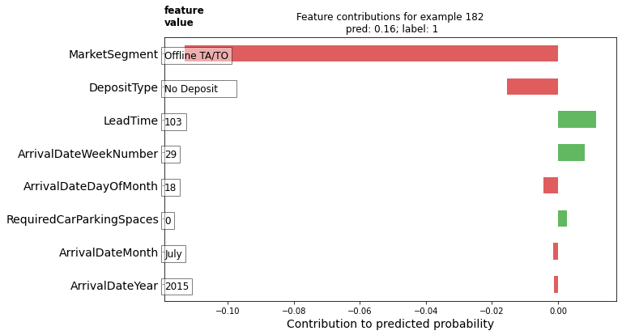
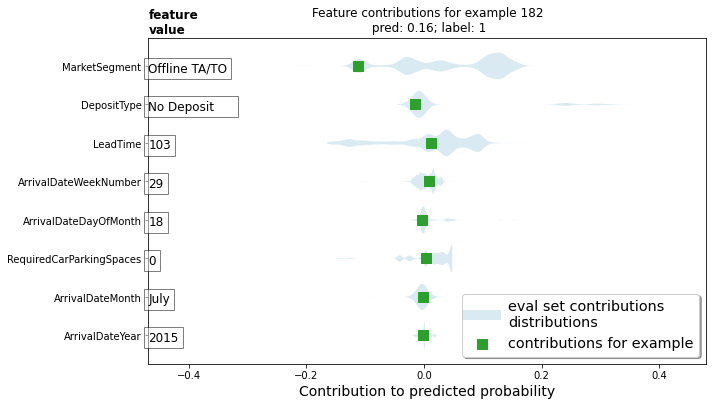
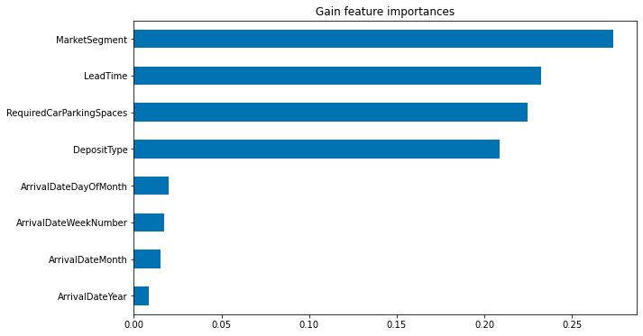
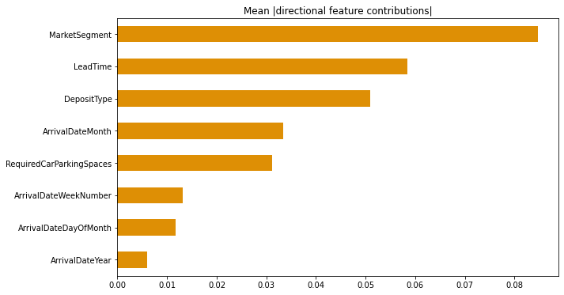
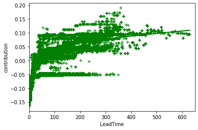
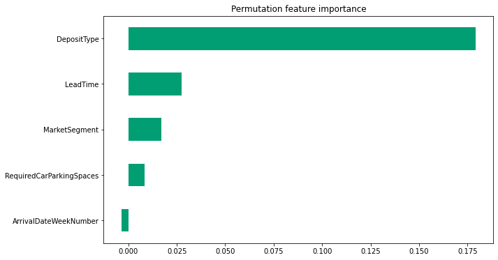

[Home](https://mgcodesandstats.github.io/) |
[GitHub](https://github.com/mgcodesandstats) |
[Speaking Engagements](https://mgcodesandstats.github.io/speaking-engagements/) |
[Terms](https://mgcodesandstats.github.io/terms/) |
[E-mail](mailto:contact@michael-grogan.com)

# Predicting Hotel Cancellations with Gradient Boosted Trees: tf.estimator

TensorFlow Estimators (or the tf.estimator API) can be used to develop a Gradient Boosting Model using decision trees.

The Gradient Boosted Trees model is used here to predict hotel cancellation instances. In particular, the contribution of the selected features to cancellation incidences is analysed at both the local and global level.

- **Local**: Interpretability of a single feature or relationship in the model. This is determined in this instance using Directional Feature Contributions (DFCs).

- **Global**: Interpretability of the model as a whole. This is determined in this instance using **gain-based feature importances**, **average absolute DFCs**, and **permutation feature importance**.

The examples illustrated in this article use the template from the [Gradient Boosted Trees: Model understanding](https://www.tensorflow.org/tutorials/estimator/boosted_trees_model_understanding) tutorial, of which the original authors (Copyright 2019 The TensorFlow Authors) have made available under the Apache 2.0 license.

## Data preprocessing

Selected features identified as important using previous feature selection methods are used to determine the influence of each feature to hotel cancellation incidences - both from a local and global interpretability perspective.

```
fc = tf.feature_column
CATEGORICAL_COLUMNS = ['MarketSegment', 'DepositType', 'ArrivalDateMonth']
NUMERIC_COLUMNS = ['LeadTime', 'RequiredCarParkingSpaces', 'ArrivalDateYear', 'ArrivalDateWeekNumber', 'ArrivalDateDayOfMonth']
```

One-hot encoding is performed on the categorical features to ensure proper interpretability by the model.

# Model Parameters

The model is defined as follows:

```
params = {
  'n_trees': 50,
  'max_depth': 3,
  'n_batches_per_layer': 1,
  # You must enable center_bias = True to get DFCs. This will force the model to
  # make an initial prediction before using any features (e.g. use the mean of
  # the training labels for regression or log odds for classification when
  # using cross entropy loss).
  'center_bias': True
}

est = tf.estimator.BoostedTreesClassifier(feature_columns, **params)
# Train model.
est.train(train_input_fn, max_steps=100)

# Evaluation.
results = est.evaluate(eval_input_fn)
clear_output()
pd.Series(results).to_frame()
```

# Model Results

Here are the model results.



*Predicted Probabilities*



*ROC Curve*



The AUC is reasonably high at 80%. Recall is lower at 55% - meaning that of all cancelled bookings in the H2 dataset - the model correctly identifies 55% of them. Precision is higher at 74%, which is expected - since most bookings are not cancelled and the customer follows through.

# Local Interpretability

As previously mentioned, Directional Feature Contributions (DCFs) are used in order to determine the influence of each feature on hotel cancellations.

As detailed in the [TensorFlow tutorial](https://www.tensorflow.org/tutorials/estimator/boosted_trees_model_understanding):

```
Sum of DFCs + bias == probabality
```



Here is a chart detailing the feature contributions:



This can also be assessed by means of a violin plot. This is similar to a box plot, but allows for an added comparison of probability distribution across separate categories.



From these charts, we can see that the MarketSegment feature significantly decreased the probability of a cancellation.

Specifically, bookings made through offline travel agencies (Offline TA/TO) were particularly associated with a decreased probability of cancellations - indicating that this market segment could be of particular interest to hotels.

# Global Interpretability

## 1. Gain-based feature importances

'Gain' is used to describe the relative importance of each feature in the model by assessing the contribution of that feature for each tree in the model - a [higher gain](https://datascience.stackexchange.com/questions/12318/how-to-interpret-the-output-of-xgboost-importance) implies that the feature is more important in determining the prediction outcome.

Here are the feature importances as ranked by gain in this instance.



*MarketSegment*, *LeadTime*, *RequiredCarParkingSpaces*, and *DepositType* are ranked as important features in determining whether a customer will cancel their hotel booking or not.

## 2. Average absolute DCFs



When analysing *LeadTime*, which is the only numerical variable that has been ranked as a feature with high importance, we see that a higher lead time is associated with a higher probability. i.e. the longer the time between when the customer makes the booking and when they are due to stay at the hotel - the higher the likelihood of a cancellation.



## 3. Permutation feature importance

[Permutation feature importance](https://scikit-learn.org/stable/modules/permutation_importance.html) allows for a determination of how important a feature is for a particular model. For instance, a feature could be ranked as low importance for a poor model, but ranked as high in importance for a more effective model.

In this regard, permutation feature importance determines how important the feature is for the model in question, and not necessarily the importance of the feature in its own right.



For this particular model, we now see that *DepositType* is indicated as the most important variable. This is because customers who have put down a deposit on their booking are much less likely to cancel than those customers that have not. 

While this was not indicated as the most important feature across the other feature importance charts, it did still rank as one of the top features.

## Conclusion

This has been an introduction to the use of the Gradient Boosting Classifier in TensorFlow to solve a classification problem - specifically predicting the probability of a customer cancelling their hotel booking.

The above analysis has illustrated:

- The differences between local and global interpretability
- Configuration of a Gradient Boosting Classifier with *tf.estimator*
- Techniques to assess feature importance

Many thanks for reading, and the GitHub repository for this project with associated code can be found [here](https://github.com/MGCodesandStats/hotel-modelling).

## References

- [Antonio, Almeida, and Nunes: Using Data Science to Predict Hotel Booking Cancellations](https://www.researchgate.net/publication/309379684_Using_Data_Science_to_Predict_Hotel_Booking_Cancellations)

- [Data Science Stack Exchange: How To Interpret The Output of XGBoost Importance?](https://datascience.stackexchange.com/questions/12318/how-to-interpret-the-output-of-xgboost-importance)

- [Permutation Feature Importance](https://scikit-learn.org/stable/modules/permutation_importance.html)

- [TensorFlow Core - Gradient Boosted Trees: Model understanding](https://www.tensorflow.org/tutorials/estimator/boosted_trees_model_understanding)