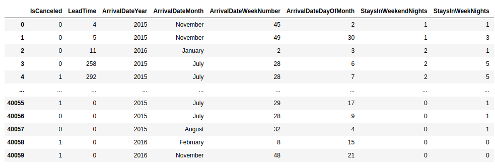
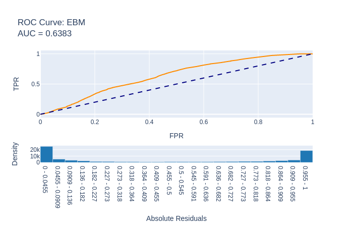
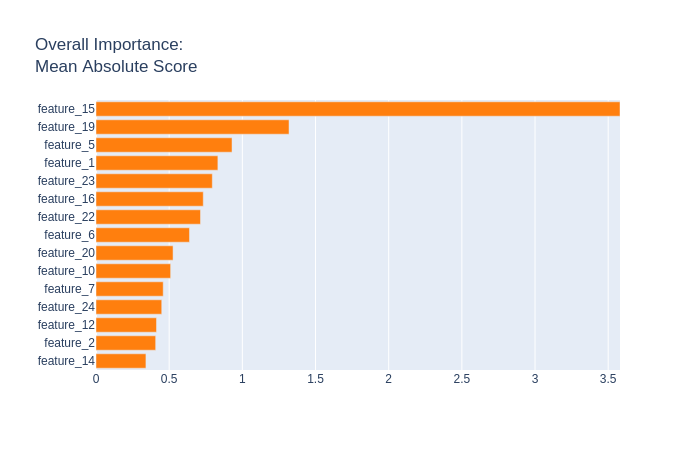
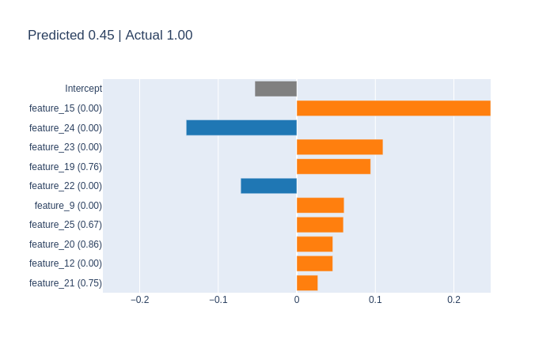
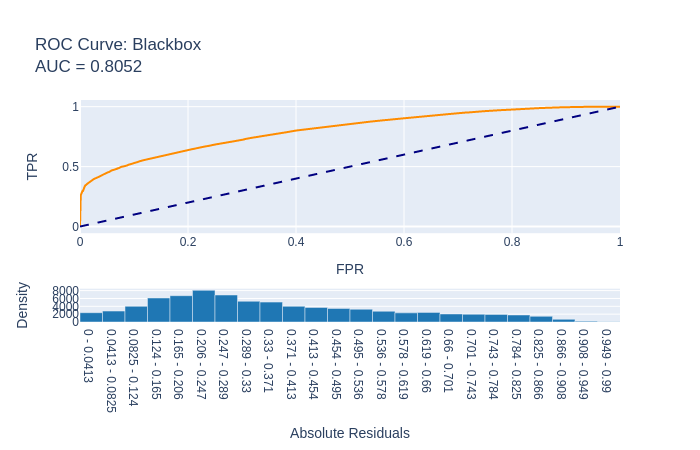

[Home](https://mgcodesandstats.github.io/) |
[GitHub](https://github.com/mgcodesandstats) |
[Speaking Engagements](https://mgcodesandstats.github.io/speaking-engagements/) |
[Terms](https://mgcodesandstats.github.io/terms/) |
[E-mail](mailto:contact@michael-grogan.com)

# Predicting Hotel Cancellations Using InterpretML

**Interpretability** is an underlooked, yet necessary facet of machine learning.

In order to deploy models into production and make research findings understandable to a non-technical audience, intelligibility or understanding of model findings are just as important as accuracy.

The purpose of the InterpretML package developed by Microsoft is to allow for increased intelligibility of black box machine learning models, while maintaining strong accuracy performance.

Here is an example of the use of the Explainable Boosting Machine (EBM) in predicting whether a customer will cancel their hotel booking or not (1 = customer cancels, 0 = customer does not cancel).

## Data Preparation

The H1 dataset is used for training purposes, while the H2 dataset is used for testing the model predictions.

The original datasets and research by Antonio et al. can be found at the reference at the end of this article. Here is a sample of the dataset:



All features in the dataset are included, with the exception of variables containing NULL values (*children*, *agent*, *company*), along with *ReservationStatusDate*.

The MinMaxScaler is used to transform the features to a scale between 0 and 1.

Given that there are more incidences of non-cancellations (0) than cancellations (1), the SMOTE oversampling method is used to create sample training data to simulate feature data for the cancellation incidences.

```
>>> counter = Counter(y_train)
>>> print(counter)

Counter({0: 21672, 1: 8373})
```

Originally, there are 21,672 entries for **0**, while there are 8,373 entries for **1**.

```
>>> oversample = SMOTE()
>>> x_train, y_train = oversample.fit_resample(x_train, y_train)
>>> counter = Counter(y_train)
>>> print(counter)

Counter({1: 21672, 0: 21672})
```

The incidences of 0s and 1s are now equal.

## Explainable Boosting Classifier

The Explainable Boosting Classifier is used as the training model.

```
>>> from interpret.glassbox import ExplainableBoostingClassifier
>>> ebm = ExplainableBoostingClassifier()
>>> ebm.fit(x_train, y_train)
>>> print("Accuracy on training set: {:.3f}".format(ebm.score(x_train, y_train)))
>>> print("Accuracy on validation set: {:.3f}".format(ebm.score(x_val, y_val)))

Accuracy on training set: 0.907
Accuracy on validation set: 0.623
```

The validation accuracy comes in at 62%.

### Precision vs. Recall and f1-score

When comparing the accuracy scores, we see that numerous readings are provided in each confusion matrix.

However, a particularly important distinction exists between **precision** and **recall**. 

```
Precision = ((True Positive)/(True Positive + False Positive))

Recall = ((True Positive)/(True Positive + False Negative))
```

The two readings are often at odds with each other, i.e. it is often not possible to increase precision without reducing recall, and vice versa.

An assessment as to the ideal metric to use depends in large part on the specific data under analysis. For example, cancer detection screenings that have false negatives (i.e. indicating patients do not have cancer when in fact they do), is a big no-no. Under this scenario, recall is the ideal metric.

However, for emails - one might prefer to avoid false positives, i.e. sending an important email to the spam folder when in fact it is legitimate.

The f1-score takes both precision and recall into account when devising a more general score.

Which would be more important for predicting hotel cancellations?

Well, from the point of view of a hotel - they would likely wish to identify customers who are ultimately going to cancel their booking with greater accuracy - this allows the hotel to better allocate rooms and resources. Identifying customers who are not going to cancel their bookings may not necessarily add value to the hotel's analysis, as the hotel knows that a significant proportion of customers will ultimately follow through with their bookings in any case.

### Performance on Test Set

When running the model on the test set (H2) - the following confusion matrix indicates a **55%** accuracy overall based on the f1-score, while recall for the cancellation class is at **87%** (meaning that of all customers who cancel their booking - the model identifies 87% of them correctly):

```
[[14848 31380]
 [ 4437 28665]]
              precision    recall  f1-score   support

           0       0.77      0.32      0.45     46228
           1       0.48      0.87      0.62     33102

    accuracy                           0.55     79330
   macro avg       0.62      0.59      0.53     79330
weighted avg       0.65      0.55      0.52     79330
```

Here is the generated ROC curve:



The top 5 features are identified.



Lead time (*feature 1*), stays on weekend nights (*feature 5*), required car parking spaces (*feature 15*), country (*feature 19*), and assigned room type (*feature 23*) are identified as the five most influential factors on whether a customer will cancel their hotel booking or not.

Let's compare the accuracy metrics from the confusion matrix to that of a standard XGBoost model run using the same features:

```
[[12650 33578]
 [ 1972 31130]]
              precision    recall  f1-score   support

           0       0.87      0.27      0.42     46228
           1       0.48      0.94      0.64     33102

    accuracy                           0.55     79330
   macro avg       0.67      0.61      0.53     79330
weighted avg       0.70      0.55      0.51     79330
```

Recall for XGBoost is slightly higher at **94%**, while overall accuracy remains at **55%**.

## Random Forest Classifier

Let's see how the *RandomForestClassifier* fares as a black box classification system for this problem.

```
from sklearn.ensemble import RandomForestClassifier
from sklearn.decomposition import PCA
from sklearn.pipeline import Pipeline

pca = PCA()
rf = RandomForestClassifier(n_estimators=100, n_jobs=-1)

blackbox_model = Pipeline([('pca', pca), ('rf', rf)])
blackbox_model.fit(x_train, y_train)
```

Let's take a look at the identified features in order of importance.

```
from interpret.blackbox import LimeTabular
lime = LimeTabular(predict_fn=blackbox_model.predict_proba, data=x_train, random_state=1)
lime_local = lime.explain_local(a_scaled[:5], b[:5], name='LIME')
show(lime_local)
```



While the importance of features differs somewhat from the Explainable Boosting Classifier, required car parking spaces and country (*features 15 and 19*) are still identified as important influencing factors on hotel cancellations.

Here is the ROC curve generated on the test set:



Here is the associated confusion matrix:

```
[[43711  2517]
 [17992 15110]]
              precision    recall  f1-score   support

           0       0.71      0.95      0.81     46228
           1       0.86      0.46      0.60     33102

    accuracy                           0.74     79330
   macro avg       0.78      0.70      0.70     79330
weighted avg       0.77      0.74      0.72     79330
```

Overall accuracy based on the f1-score is much higher at 74%, while recall for the cancellation class is significantly lower at 46%. In this regard, this model does a better job at predicting the overall outcome (both cancellations and non-cancellations).

However, if we are looking to predict specifically which customers will cancel their booking, then the Explainable Boosting Classifier is a better model for this purpose.

## Conclusion

As mentioned, the emphasis of InterpretML is on making model results **intelligible** as well as accurate. From this standpoint, this library is a very useful tool in allowing for an intuitive and understandable display of results.

Many thanks for reading, and the GitHub repository for this project with associated code can be found [here](https://github.com/MGCodesandStats/hotel-modelling).

## References
- [Antonio, Almeida, and Nunes: Using Data Science to Predict Hotel Booking Cancellations](https://www.researchgate.net/publication/309379684_Using_Data_Science_to_Predict_Hotel_Booking_Cancellations)

- [GitHub: Fit interpretable models. Explain blackbox machine learning.](https://github.com/interpretml/interpret)

- [Microsoft Developer: The Science Behind InterpretML: Explainable Boosting Machine](https://www.youtube.com/watch?v=MREiHgHgl0k)