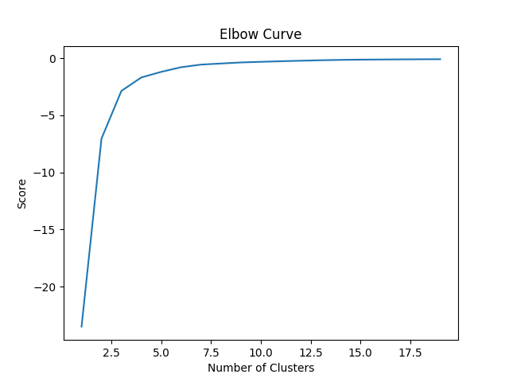
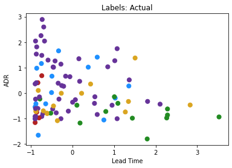
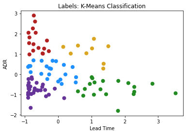
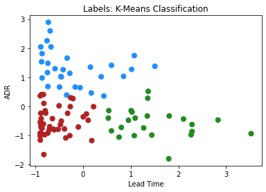

[Home](https://mgcodesandstats.github.io/) |
[GitHub](https://github.com/mgcodesandstats) |
[Speaking Engagements](https://mgcodesandstats.github.io/speaking-engagements/) |
[Terms](https://mgcodesandstats.github.io/terms/) |
[E-mail](mailto:contact@michael-grogan.com)

# K-Means Clustering: Identifying Profitable Hotel Customers

A K-Means Clustering algorithm allows us to group observations in close proximity to the mean. This allows us to create greater efficiency in categorising the data into specific segments.

In this instance, K-Means is used to analyse market segment clusters for a hotel in Portugal.

This analysis is based on the original study by **Antonio, Almeida and Nunes** as cited in the References section below.

Given lead time (the period of time from when the customer makes their booking to when they actually stay at the hotel), along with ADR (average daily rate per customer), the k-means clustering algorithm is used to visually identify which market segments are most profitable for the hotel.

A customer with a high ADR and a low lead time is ideal, as it means that 1) the customer is paying a high daily rate which means a greater profit margin for the hotel, while a low lead time means that the customer pays for their booking quicker - which increases cash flow for the hotel in question.

## Data Manipulation

The data is loaded and 200 samples are chosen at random:

```
df = pd.read_csv('H1full.csv')
df = df.sample(n = 200)
```

The interval (or continuous random variables) are of **lead time** and **ADR** are defined as below:

```
leadtime = df['LeadTime']
adr = df['ADR']
```

Variables with a categorical component are defined using '''cat.codes''', in this case **market segment**.

```
marketsegmentcat=df.MarketSegment.astype("category").cat.codes
marketsegmentcat=pd.Series(marketsegmentcat)
```

The purpose of this is to assign categorical codes to each market segment. For instance, here is a snippet of some of the market segment entries in the dataset:

```
10871        Online TA
7752         Online TA
35566    Offline TA/TO
1353         Online TA
17532        Online TA
             ...      
1312         Online TA
10364           Groups
16113           Direct
23633        Online TA
23406           Direct
```

Upon applying ```cat.codes```, here are the corresponding categories.

```
10871    4
7752     4
35566    3
1353     4
17532    4
        ..
1312     4
10364    2
16113    1
23633    4
23406    1
```

The market segment labels are as follows:

- **0** = Corporate
- **1** = Direct
- **2** = Groups
- **3** = Offline TA/TO
- **4** = Online TA

The lead time and ADR features are scaled using sklearn:

```
from sklearn.preprocessing import scale
X = scale(x1)
```

Here is a sample of X:

```
array([[ 1.07577693, -1.01441847],
       [-0.75329711,  2.25432473],
       [-0.60321924, -0.80994917],
       [-0.20926483,  0.26328418],
       [ 0.53174465, -0.40967609],
       [-0.82833604,  0.40156369],
       [-0.89399511, -1.01810593],
       [ 0.59740372,  1.40823851],
       [-0.89399511, -1.16560407],
```

## K-Means Clustering

When it comes to choosing the number of clusters, one possible solution is to use what is called the **elbow method**. Here is an example of an elbow curve:



This is a technique whereby the in-cluster variance for each cluster is calculated - the lower the variance, the tighter the cluster.

In this regard, as the score starts to flatten out, this means that the reduction in variance becomes less and less as we increase the number of clusters, which allows us to determine the ideal value for **k**.

However, this technique is not necessarily suitable for smaller clusters. Moreover, we already know the number of clusters (k=5) that we wish to define, as we already know the number of market segments that we wish to analyse.

Additionally, while k-means clustering methods may also use PCA (or Principal Dimensionality Reduction) to reduce the number of features, this is not appropriate in this case as the only two features being used (apart from market segment) are **ADR** and **lead time**.

Accordingly, the k-means algorithm is defined as follows:

```
>>> km = KMeans(n_clusters = 5, n_jobs = None, random_state = None)
>>> km.fit(X)

KMeans(algorithm='auto', copy_x=True, init='k-means++', max_iter=300,
       n_clusters=5, n_init=10, n_jobs=None, precompute_distances='auto',
       random_state=None, tol=0.0001, verbose=0)
```

The color themes are defined for each of the market segment labels:

```
# Market Segment Labels: 0 (Complementary) = firebrick, 1 (Corporate) = dodgerblue, 2 (Direct) = forestgreen, 3 (Groups) = goldenrod, 4 (Offline TA/TO) = rebeccapurple

color_theme = np.array(['firebrick', 'dodgerblue', 'forestgreen', 'goldenrod', 'rebeccapurple'])
```

Here is a plot of the actual labels:



Here is a plot of the generated clusters by the k-means algorithm:



As mentioned, customers with the lowest lead time and the highest ADR are deemed to be the most profitable.

However, there seems to be a problem! Many of the market segment categories have been mislabelled.

This is a common problem when working with k-means clustering, and does not necessarily indicate that the model should be thrown out! Instead, it merely suggests that we need to think about our data in a different way.

For instance, we already know which customers belong to which market segment. In this regard, generating a k-means clustering algorithm to predict this once again does not serve much use. Rather, the point of running this algorithm is to get a quick visual of what types of customers are most profitable.

Furthermore, we have only considered lead time and ADR as the two features. There may be other features that we have not considered which would better indicate what market segment a customer might belong to, and there is no visual evidence from what we have seen so far that certain market segments are more profitable than others.

In this regard, let's simplify the analysis a little bit. What if we use three clusters instead?



We see that the blue category has the highest ADR and lowest lead time (most profitable), while the green category shows the lowest ADR and highest lead time (least profitable).

From this standpoint, the k-means clustering algorithm is offering an efficient way at quickly categorising the hotel's most profitable customers and further analysis can be conducted to analyse certain attributes that are common to the customers in each group.

When it comes to unsupervised learning - it is important to remember that this is largely an **exploratory** method of analysis - the goal is not necessarily prediction but rather to reveal insights about the data that may not have been considered previously. For instance, why do certain customers have a lower lead time than others? Are customers from certain countries more likely to fit this profile? What about different customer types?

These are all questions that the k-means clustering algorithm may not directly answer for us - but reducing data into separate clusters provides a strong baseline for being able to pose questions such as these.

## Conclusion

In this example, we have seen:

- How to use Python to conduct k-means clustering
- Use of k-means clustering in segmenting hotel customers by profitability
- Configuration of data to use the k-means model effectively

Many thanks for your time, and the associated GitHub repository for this example can be found [here](https://github.com/MGCodesandStats/hotel-modelling).

## References

- [Antonio, Almeida, and Nunes: Using Data Science to Predict Hotel Booking Cancellations](https://www.researchgate.net/publication/309379684_Using_Data_Science_to_Predict_Hotel_Booking_Cancellations)

- [OpenClassrooms: Carry Out A K-Means Clustering](https://openclassrooms.com/en/courses/5869986-perform-an-exploratory-data-analysis/6177851-carry-out-a-k-means-clustering)

- [Medium: PREDICTING IRIS FLOWER SPECIES WITH K-MEANS CLUSTERING IN PYTHON](https://medium.com/@belen.sanchez27/predicting-iris-flower-species-with-k-means-clustering-in-python-f6e46806aaee)

- [Towards Data Science: When Clustering Doesn't Make Sense](https://towardsdatascience.com/when-clustering-doesnt-make-sense-c6ed9a89e9e6)

- [Variance Explained: K-Means Clustering Is Not A Free Lunch](http://varianceexplained.org/r/kmeans-free-lunch/)