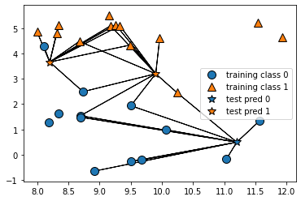

[Home](https://mgcodesandstats.github.io/) |
[GitHub](https://github.com/mgcodesandstats) |
[Speaking Engagements](https://mgcodesandstats.github.io/speaking-engagements/) |
[Terms](https://mgcodesandstats.github.io/terms/) |
[E-mail](mailto:contact@michael-grogan.com)

# Classification of Hotel Cancellations Using KNN and SMOTE

KNN (K-Nearest Neighbors) is a go-to method for classification purposes.

In this particular example, the KNN algorithm is used to classify hotel bookings in terms of cancellation risk (1 = model predicts that the customer will cancel their booking, 0 = customer is not predicted to cancel their booking).

Given that this dataset is unbalanced, i.e. there are more 0s (non-cancellations) than 1s (cancellations), the Synthetic Minority Oversampling Technique (SMOTE) is used to balance the classes in order to apply the KNN algorithm.

## SMOTE Oversampling Technique

Given the uneven nature of the dataset, it is necessary to oversample the minor class (1 = cancellations) in order to ensure that the KNN results are not skewed towards the major class.

This can be done by using the SMOTE oversampling technique.

After having imported and scaled the data using MinMaxScaler, SMOTE can be imported from the imblearn library. Counter is imported for the purposes of summarizing the class distributions.

```
import imblearn
print(imblearn.__version__)
from imblearn.over_sampling import SMOTE
from collections import Counter
```

Firstly, a train-test split is invoked to separate the data into training and validation data.

```
x1_train, x1_val, y1_train, y1_val = train_test_split(x_scaled, y1, random_state=0)
```

The original class distribution is comprised of **0**: 21672, **1**: 8373.

```
>>> counter = Counter(y_train)
>>> print(counter)

Counter({0: 21672, 1: 8373})
```

However, after applying the SMOTE oversampling technique, we now see that the number of observations in each class are equal.

```
>>> oversample = SMOTE()
>>> x_train, y_train = oversample.fit_resample(x_train, y_train)
>>> counter = Counter(y_train)
>>> print(counter)

Counter({1: 21672, 0: 21672})
```

## Model Performance

The model is configured as follows:

```
# KNN
knn = KNeighborsClassifier(n_neighbors=10)
model=knn.fit(x1_train, y1_train)
pred = model.predict(x1_val)
pred
print("Training set score: {:.2f}".format(knn.score(x1_train, y1_train)))
print("Validation set score: {:.2f}".format(knn.score(x1_val, y1_val)))

# KNN Plot
mglearn.plots.plot_knn_classification(n_neighbors=10)
plt.show()
```

The training and test set scores are generated:

```
Training set score: 0.88
Validation set score: 0.46
```

Here is a visual of the training classes versus test predictions as illustrated by the KNN model:



Here is a breakdown of model performance according to a confusion matrix:

```
[[2286 4980]
 [ 440 2309]]
              precision    recall  f1-score   support

           0       0.84      0.31      0.46      7266
           1       0.32      0.84      0.46      2749

    accuracy                           0.46     10015
   macro avg       0.58      0.58      0.46     10015
weighted avg       0.70      0.46      0.46     10015
```

While overall accuracy is quite low at 46%, recall according to the f1-score is reasonably good at 84%.

### Precision vs. Recall

When working with classification data, one must also pay attention to the precision versus recall readings, as opposed to simply overall accuracy.

```
Precision = ((True Positive)/(True Positive + False Positive))
Recall = ((True Positive)/(True Positive + False Negative))
```

The two readings are often at odds with each other, i.e. it is often not possible to increase precision without reducing recall, and vice versa.

An assessment as to the ideal metric to use depends in large part on the specific data under analysis. For example, cancer detection screenings that have false negatives (i.e. indicating patients do not have cancer when in fact they do), is a big no-no. Under this scenario, recall is the ideal metric.

However, for emails — one might prefer to avoid false positives, i.e. sending an important email to the spam folder when in fact it is legitimate.

The f1-score takes both precision and recall into account when devising a more general score.

Which would be more important for predicting hotel cancellations?

Well, from the point of view of a hotel — they would likely wish to identify customers who are ultimately going to cancel their booking with greater accuracy — this allows the hotel to better allocate rooms and resources. Identifying customers who are not going to cancel their bookings may not necessarily add value to the hotel’s analysis, as the hotel knows that a significant proportion of customers will ultimately follow through with their bookings in any case.

## Test Data

Let us see how the results look when the model makes predictions on H2 (the test set).

Here, we see that the f1-score accuracy has increased slightly to 52%.

```
[[12569 33659]
 [ 4591 28511]]
              precision    recall  f1-score   support

           0       0.73      0.27      0.40     46228
           1       0.46      0.86      0.60     33102

    accuracy                           0.52     79330
   macro avg       0.60      0.57      0.50     79330
weighted avg       0.62      0.52      0.48     79330
```

However, the recall for the cancellation class (1) stands at 86%. As mentioned, precision and recall are often at odds with each other simply due to the fact that false positives tend to increase recall, while false negatives tend to increase precision.

Assuming that the hotel would like to maximise recall (i.e. tolerate a certain number of false positives while at the same time identifying all customers who will cancel their booking), then this model meets that criteria.

Of all customers who cancel their booking, this model correctly identifies 86% of those customers.

## Model Assessment

While a higher recall is assumed to be a better way to judge this model, this cannot necessarily come at the expense of lower accuracy.

If recall is penalising false negatives, then it is also favouring false positives - having too many false positives defeats the purpose of the model - as this is essentially assuming that all customers will cancel, which is not the case.

In this regard, accuracy and recall would ideally be maximised. For instance, an [XGBoost model](https://www.michael-grogan.com/hotel-modelling/articles/boosting) demonstrated a recall of 94% with an f1-score accuracy of 55% - both of which were slightly higher than in this example. 

## Conclusion

In this example, you have seen:

- The use of KNN as a classification algorithm
- How K-fold cross-validation can provide a better overview of model performance
- Importance of precision versus recall in judging model performance.

Many thanks for your time, and the associated GitHub repository for this example can be found [here](https://github.com/MGCodesandStats/hotel-modelling).

## References

- [GitHub repository (Msanjayds): Cross-Validation calculation](https://github.com/Msanjayds/Scikit-learn/blob/master/CrossValidation.ipynb)
- [Machine Learning Mastery: SMOTE Oversampling for Imbalanced Classification with Python](https://machinelearningmastery.com/smote-oversampling-for-imbalanced-classification/)