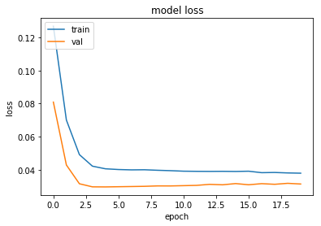
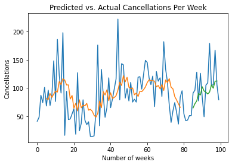
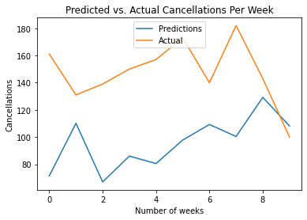
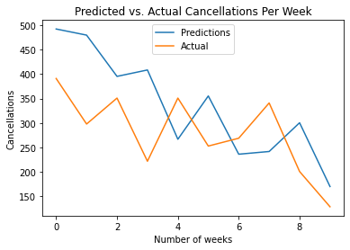

[Home](https://mgcodesandstats.github.io/) |
[GitHub](https://github.com/mgcodesandstats) |
[Speaking Engagements](https://mgcodesandstats.github.io/speaking-engagements/) |
[Terms](https://mgcodesandstats.github.io/terms/) |
[E-mail](mailto:contact@michael-grogan.com)

# Predicting Weekly Hotel Cancellations with an LSTM Network

Hotel cancellations can be problematic for businesses in the industry - cancellations lead to lost revenue, and this can also cause difficulty in coordinating bookings and adjusting revenue management practices.

Aside from analyzing which customers are less likely to cancel their bookings and allow hotels to amend their marketing strategy accordingly, it can also be useful to predict fluctuations in cancellations on a week-by-week basis in order for hotel chains to allocate capacity accordingly.

LSTMs are sequential neural networks that assume dependence between the observations in a particular series. As such, they have increasingly come to be used for time series forecasting purposes.

In the last example, the cancellation data was already sorted into weekly values by pandas. The total weekly cancellations were sorted as follows:


Now, an LSTM is used to predict cancellations for both the validation and test sets, and ultimately gauge model performance in terms of mean directional accuracy and root mean square error (RMSE).

Here is a sample of the time series:


The Dickey-Fuller test was used to test for stationarity. With a p-value of 0.05, a unit root is not indicated to be present and the alternative hypothesis of stationarity is supported.

```
ADF Statistic: -2.914054
p-value: 0.043738
Critical Values:
	1%: -3.490
	5%: -2.888
	10%: -2.581
```

## Dataset Matrix Formation and Model Configuration

Let’s begin the analysis for the H1 dataset. The first 100 observations from the created time series is called. Then, a dataset matrix is created and the data is scaled.

```
df = df[:100]

# Form dataset matrix
def create_dataset(df, previous=1):
    dataX, dataY = [], []
    for i in range(len(df)-previous-1):
        a = df[i:(i+previous), 0]
        dataX.append(a)
        dataY.append(df[i + previous, 0])
    return np.array(dataX), np.array(dataY)
```

The data is then normalized with MinMaxScaler in order to allow the neural network to interpret it properly:

```
# normalize dataset with MinMaxScaler
scaler = MinMaxScaler(feature_range=(0, 1))
df = scaler.fit_transform(df)
df
```

Here is a sample of the output:

```
array([[0.12980769],
       [0.16346154],
       [0.35096154],
       [0.28846154],
       [0.41826923],
       [0.25961538],
       [0.39423077],
...
       [0.45673077],
       [0.79326923],
       [0.43269231],
       [0.44230769],
       [0.73557692],
       [0.44230769],
       [0.3125    ]])
```

The data is partitioned into training and test sets, with the *previous* parameter set to 5:

```
import tensorflow as tf
from tensorflow.keras import layers
from tensorflow.keras.layers import Dense
from tensorflow.keras.layers import LSTM

# Training and Validation data partition
train_size = int(len(df) * 0.8)
val_size = len(df) - train_size
train, val = df[0:train_size,:], df[train_size:len(df),:]

# Number of previous
previous = 5
X_train, Y_train = create_dataset(train, previous)
X_val, Y_val = create_dataset(val, previous)
```

When the *previous* parameter is set to this, this essentially means that the value at time *t* (Y_train for the training data), is being predicted using the values *t-1*, *t-2*, *t-3*, *t-4*, and *t-5* (all under X_train).

Here is a sample of the *Y_train* array:

```
array([0.25961538, 0.39423077, 0.26442308, 0.35576923, 0.64423077,
       0.29807692, 0.82692308, 0.52403846, 0.37019231, 0.88461538,
       0.00961538, 0.38461538, 0.14423077, 0.14903846, 0.19230769,
...
       0.28846154, 0.20673077, 0.10576923, 0.33653846])
```

Here is a sample of the *X_train* array:

```
array([[0.12980769, 0.16346154, 0.35096154, 0.28846154, 0.41826923],
       [0.16346154, 0.35096154, 0.28846154, 0.41826923, 0.25961538],
       [0.35096154, 0.28846154, 0.41826923, 0.25961538, 0.39423077],
       [0.28846154, 0.41826923, 0.25961538, 0.39423077, 0.26442308],
       [0.41826923, 0.25961538, 0.39423077, 0.26442308, 0.35576923],
...
       [0.12019231, 0.21634615, 0.28846154, 0.20673077, 0.10576923]])
```       

20 epochs are run:

```
# reshape input to be [samples, time steps, features]
X_train = np.reshape(X_train, (X_train.shape[0], 1, X_train.shape[1]))
X_val = np.reshape(X_val, (X_val.shape[0], 1, X_val.shape[1]))

# Generate LSTM network
model = tf.keras.Sequential()
model.add(LSTM(4, input_shape=(1, previous)))
model.add(Dense(1))
model.compile(loss='mean_squared_error', optimizer='adam')
model.fit(X_train, Y_train, epochs=20, batch_size=1, verbose=2)
```

Here are some sample results:

```
Train on 59 samples, validate on 15 samples
Epoch 1/20
59/59 - 0s - loss: 0.0865 - val_loss: 0.0408
Epoch 2/20
59/59 - 0s - loss: 0.0583 - val_loss: 0.0328
Epoch 3/20
59/59 - 0s - loss: 0.0516 - val_loss: 0.0332
Epoch 4/20
59/59 - 0s - loss: 0.0503 - val_loss: 0.0348
Epoch 5/20
59/59 - 0s - loss: 0.0497 - val_loss: 0.0341
...
Epoch 16/20
59/59 - 0s - loss: 0.0453 - val_loss: 0.0336
Epoch 17/20
59/59 - 0s - loss: 0.0449 - val_loss: 0.0333
Epoch 18/20
59/59 - 0s - loss: 0.0445 - val_loss: 0.0329
Epoch 19/20
59/59 - 0s - loss: 0.0447 - val_loss: 0.0338
Epoch 20/20
59/59 - 0s - loss: 0.0442 - val_loss: 0.0329
dict_keys(['loss', 'val_loss'])
```

This is a visual representation of the training and validation loss:



## Training and Validation Predictions

Now, let’s generate some predictions.

```
# Generate predictions
trainpred = model.predict(X_train)
valpred = model.predict(X_val)
```

Here is a sample of training and test predictions:

**Training Predictions**

```
>>> trainpred
array([[0.32294273],
       [0.3152437 ],
       [0.36545992],
...
       [0.31116793],
       [0.2784281 ],
       [0.24806169]], dtype=float32)
```

**Test Predictions**

```
>>> valpred

array([[0.24374226],
       [0.2790607 ],
       [0.30287346],
...
       [0.41147274],
       [0.47115234],
       [0.4726988 ]], dtype=float32)
```

The predictions are converted back to normal values using ```scaler.inverse_transform```, and the training and test score is calculated.

```
import math
from sklearn.metrics import mean_squared_error

# calculate RMSE
trainScore = math.sqrt(mean_squared_error(Y_train[0], trainpred[:,0]))
print('Train Score: %.2f RMSE' % (trainScore))
testScore = math.sqrt(mean_squared_error(Y_test[0], testpred[:,0]))
print('Test Score: %.2f RMSE' % (testScore))
```

**Training and Validation Scores**

```
Train Score: 42.31 RMSE
Validation Score: 36.90 RMSE
```

Here is a plot of the predictions:



The test and prediction arrays are reshaped accordingly, and the function for *mean directional accuracy* is defined:

```
import numpy as np

def mda(actual: np.ndarray, predicted: np.ndarray):
    """ Mean Directional Accuracy """
    return np.mean((np.sign(actual[1:] - actual[:-1]) == np.sign(predicted[1:] - predicted[:-1])).astype(int))
```

### Model Results

The mean directional accuracy is now calculated:

```
>>> mda(Y_val, predictions)
0.8571428571428571
```

An MDA of **86%** is obtained, meaning that the model correctly predicts the direction of the actual weekly cancellation trends 86% of the time.

As seen above, a validation score of **36.61** RMSE was also obtained. RMSE is a measure of the deviation in cancellations from the actual values, and assumes the same numerical format as the same. The mean weekly cancellations across the validation data was **35.97**.

## Testing on unseen (test) data

Now that the model has been trained, the next step is to test the predictions of the model on unseen (or test data).

As previously explained, the value at time *t* is being predicted by LSTM using the values *t-1*, *t-2*, *t-3*, *t-4*, and *t-5*.

The last 10 weekly cancellation values in the series are predicted in this case.

```
actual = np.array([[161,131,139,150,157,173,140,182,143,100]])
```

The previously built model is now used to predict each value using the previous five values in the time series:

```
# Test (unseen) predictions
# (t) and (t-5)
>>> XNew

array([[130, 202, 117, 152, 131],
       [202, 117, 152, 131, 161],
       [117, 152, 131, 161, 131],
       [152, 131, 161, 131, 139],
       [131, 161, 131, 139, 150],
       [161, 131, 139, 150, 157],
       [131, 139, 150, 157, 173],
       [139, 150, 157, 173, 140],
       [150, 157, 173, 140, 182],
       [157, 173, 140, 182, 143]])
```

The variables are scaled appropriately, and ```model.predict``` is invoked:

```
Xnew = scaler.transform(Xnew)
Xnew
Xnewformat = np.reshape(Xnew, (Xnew.shape[0], 1, Xnew.shape[1]))
ynew=model.predict(Xnewformat)
```

Here is an array of the generated predictions:

```
array([0.14147764, 0.38846755, 0.33262578, 0.30260864, 0.24446128,
       0.44191664, 0.52529824, 0.5520171 , 0.4564184 , 0.5267743 ],
      dtype=float32)
```

The array is converted back to the original value format:

```
>>> ynew = ynew * np.abs(maxcancel-mincancel) + np.min(tseries)
>>> ynewpd=pd.Series(ynew)
>>> ynewpd

0     43.427349
1     94.801254
2     83.186165
3     76.942596
4     64.847946
5    105.918663
6    123.262032
7    128.819550
8    108.935028
9    123.569054
dtype: float32
```

Here is the calculated **MDA**, **RMSE**, and **MFE (mean forecast error)**.

**MDA**

```
>>> mda(actualpd, ynewpd)

0.8
```

**RMSE**

```
>>> mse = mean_squared_error(actualpd, ynewpd)
>>> rmse = sqrt(mse)
>>> print('RMSE: %f' % rmse)

RMSE: 60.922363
```

**MFE**

```
>>> forecast_error = (ynewpd-actualpd)
>>> mean_forecast_error = np.mean(forecast_error)
>>> mean_forecast_error

-51.62492065429687
```

Here is a plot of the predicted vs actual cancellations per week:



As we can see, the MDA has dropped slightly, and the RMSE has increased to 66. Based on the graph and the mean forecast error, the model has a tendency to underestimate the values for the weekly cancellations; i.e. the forecast is negatively biased.

## H2 results

The same procedure was carried out on the H2 dataset (cancellation data for a separate hotel in Portugal). Here are the results when comparing the predictions to the test set:

**MDA**

```
>>> mda(actualpd, ynewpd)

0.8
```

**RMSE**

```
# mean cancellations per week for this hotel was 280 across the test set

>>> mse = mean_squared_error(actualpd, ynewpd)
>>> rmse = sqrt(mse)
>>> print('RMSE: %f' % rmse)

RMSE: 109.532103
```

**MFE**

```
>>> forecast_error = (ynewpd-actualpd)
>>> mean_forecast_error = np.mean(forecast_error)
>>> mean_forecast_error

54.073117065429685  
```

Again, a plot for the predicted vs actual cancellations per week is generated:



## Comparison with ARIMA

Weekly hotel cancellations were predicted using ARIMA instead of LSTM in a previous post.

Here is a comparison of prediction performance across the H1 and H2 datasets for both models.

### H1 Results

| Reading      | ARIMA | LSTM |
| ----------- | ----------- | ----------- |
| MDA      | 0.86       | 0.8       |
| RMSE   | 57.95        | 60.92       |
| MFE   | -12.72        | -51.62        |


### H2 Results

| Reading      | ARIMA | LSTM |
| ----------- | ----------- | ----------- |
| MDA      | 0.86       | 0.8       |
| RMSE   | 274.08        | 109.53        |
| MFE   | 156.33        | 54.07        |

Based on the RMSE measure, LSTM shows superior performance for H2.

Interestingly, MDA remains slightly higher when predicting using ARIMA, while MFE shows better performance on H1 when using ARIMA.

In this regard, the "no free lunch theorem" applies in this case. In other words, both models have shown superior performance across different time series and metrics, and it would be erroneous to simply choose one over another.

Let's compare the two time series once again.

**H1**


**H2**


It can be observed that the second time series is significantly more volatile than the first (there is more of a "zig-zag" pattern present).

In this regard, LSTM has been more adept at modelling the volatility for the second time series, while the ARIMA model has shown better predictive accuracy on an MFE basis when modelling the smoother trend for the H1 series.

Therefore, this shows that LSTM is not necessarily a better model than ARIMA simply because it is a machine learning model. Rather, ARIMA and LSTM have been shown to yield predictive accuracy under different circumstances - and in this case LSTM has been more adept at modelling the H2 (more volatile) time series.

## Conclusion

The above examples have illustrated:

- How to construct an LSTM model
- Methods to gauge error and accuracy for LSTM model predictions
- Comparison of LSTM model performance vs ARIMA

The datasets and notebooks for this example are available at the [MGCodesandStats GitHub repository](https://github.com/MGCodesandStats/hotel-modelling), along with further research on this topic.
