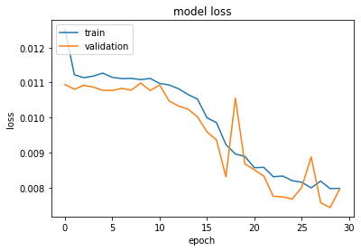

# Regression-based neural networks with TensorFlow v2.0: Predicting Average Daily Rates

Keras is an API used for running high-level neural networks - the API is now included as the default one under TensorFlow 2.0, which was developed by Google.

The main competitor to Keras at this point in time is PyTorch, developed by Facebook. While PyTorch has a somewhat higher level of community support, it is a particularly verbose language and I personally prefer Keras for greater simplicity and ease of use in building and deploying models.

In this particular example, a neural network is built in Keras to solve a regression problem, i.e. one where our dependent variable (y) is in interval format and we are trying to predict the quantity of y with as much accuracy as possible.

## What Is A Neural Network?

A neural network is a computational system that creates predictions based on existing data. Let us train and test a neural network using the neuralnet library in R.

A neural network consists of:

- Input layers: Layers that take inputs based on existing data
- Hidden layers: Layers that use backpropagation to optimise the weights of the input variables in order to improve the predictive power of the model
- Output layers: Output of predictions based on the data from the input and hidden layers


## Background

This study focuses on hotel booking analysis. When it comes to hotel bookings, **average daily rate (ADR)** is a particularly important metric. This reflects the average rate per day that a particular customer pays throughout their stay.

Gauging ADR allows hotels to more accurately identify its most profitable customers and tailor its marketing strategies accordingly.

For this example, we use a linear activation function within the keras library to create a regression-based neural network. The purpose of this neural network is to predict an **ADR** value for each customer. The chosen features that form the input for this neural network are as follows:

- IsCanceled
- Country of origin
- Market segment
- Deposit type
- Customer type
- Required car parking spaces
- Arrival Date: Year
- Arrival Date: Month
- Arrival Date: Week Number
- Arrival Date: Day of Month

Firstly, the relevant libraries are imported. Note that you will need TensorFlow installed on your system to be able to execute the below code.

```
from tensorflow.python.keras.models import Sequential
from tensorflow.python.keras.layers import Dense
from tensorflow.python.keras.wrappers.scikit_learn import KerasRegressor
import statsmodels.api as sm
import statsmodels.formula.api as smf
import matplotlib.pyplot as plt
import numpy as np
import pandas as pd
import math
from sklearn.linear_model import LogisticRegression
from sklearn.model_selection import train_test_split
from sklearn.model_selection import cross_val_score
from sklearn.model_selection import KFold
from sklearn.pipeline import Pipeline
from sklearn.preprocessing import MinMaxScaler
from sklearn.ensemble import ExtraTreesClassifier
from sklearn.metrics import mean_absolute_error
from sklearn.metrics import mean_squared_error
from sklearn.metrics import r2_score
```

As a neural network is being implemented, the variables need to be normalized for the network to interpret them properly. Therefore, the variables are transformed using the MaxMinScaler():

```
#Variables
y1=np.reshape(y1, (-1,1))
scaler_x = MinMaxScaler()
scaler_y = MinMaxScaler()
print(scaler_x.fit(x1))
xscale=scaler_x.transform(x1)
print(scaler_y.fit(y1))
yscale=scaler_y.transform(y1)
```

The data is then split into training and test data:

```
X_train, X_test, y_train, y_test = train_test_split(xscale, yscale)
```

## Neural Network Configuration

One of the most important considerations when training a neural network is choosing the number of neurons to include in the input and hidden layers. Given that the output layer is the result layer, this layer has 1 neuron present by default.

As explained in this article by [Farhad Malik](https://medium.com/fintechexplained/what-are-hidden-layers-4f54f7328263), the number of neurons in each layer is configured as follows:

- **Input layer:** The number of neurons in the input layer is calculated as follows:

```Number of features in the training set + 1```

In this case, as there were 10 features in the training set to begin with, **11** input neurons are defined accordingly.

- **Hidden layer:** One hidden layer is defined, as a single layer is suitable when working with most datasets. The number of neurons in the hidden layer is determined as follows:

```
Training Data Samples/Factor * (Input Neurons + Output Neurons)
```

A factor of 1 is set in this case, the purpose of the factor being to prevent overfitting. A factor can take a value between 1 and 10. With 11 neurons in the input layer, 1 neuron in the output layer and 24036 observations in the training set, the hidden layer is assigned 2,003 neurons.

- **Output layer:** As this is the result layer, the output layer takes a value of 1 by default.

```
model = Sequential()
model.add(Dense(11, input_dim=11, kernel_initializer='normal', activation='relu'))
model.add(Dense(2003, activation='relu'))
model.add(Dense(1, activation='linear'))
model.summary()
```

The mean_squared_error (mse) and mean_absolute_error (mae) are our loss functions – i.e. an estimate of how accurate the neural network is in predicting the test data. We can see that with the validation_split set to 0.2, 80% of the training data is used to test the model, while the remaining 20% is used for testing purposes.

```
model.compile(loss='mse', optimizer='adam', metrics=['mse','mae'])
```

From the output, we can see that the more epochs are run, the lower our MSE and MAE become, indicating improvement in accuracy across each iteration of our model.
Neural Network Output

Let’s now fit our model.

```
>>> history=model.fit(X_train, y_train, epochs=30, batch_size=150,  verbose=1, validation_split=0.2)

Epoch 1/30
161/161 [==============================] - 0s 3ms/step - loss: 0.0123 - mse: 0.0123 - mae: 0.0848 - val_loss: 0.0097 - val_mse: 0.0097 - val_mae: 0.0731
Epoch 2/30
161/161 [==============================] - 0s 2ms/step - loss: 0.0075 - mse: 0.0075 - mae: 0.0643 - val_loss: 0.0058 - val_mse: 0.0058 - val_mae: 0.0578
...
Epoch 29/30
161/161 [==============================] - 1s 4ms/step - loss: 0.0042 - mse: 0.0042 - mae: 0.0455 - val_loss: 0.0040 - val_mse: 0.0040 - val_mae: 0.0453
Epoch 30/30
161/161 [==============================] - 1s 4ms/step - loss: 0.0041 - mse: 0.0041 - mae: 0.0450 - val_loss: 0.0038 - val_mse: 0.0038 - val_mae: 0.0432
```

Here, we can see that both the training loss and validation loss is being calculated, i.e. the deviation between the predicted y and actual y as measured by the mean squared error.

30 epochs have been specified for our model. This means that we are essentially training our model over 30 forward and backward passes, with the expectation that our loss will decrease with each epoch, meaning that our model is predicting the value of y more accurately as we continue to train the model.

Let’s see what this looks like when we plot our respective losses:

```
print(history.history.keys())
# "Loss"
plt.plot(history.history['loss'])
plt.plot(history.history['val_loss'])
plt.title('model loss')
plt.ylabel('loss')
plt.xlabel('epoch')
plt.legend(['train', 'validation'], loc='upper left')
plt.show()
```


Both the training and validation loss decrease in an exponential fashion as the number of epochs is increased, suggesting that the model gains a high degree of accuracy as our epochs (or number of forward and backward passes) is increased.

## Predictions

Using the neural network model generated on the H1 dataset, the features from the H2 dataset are now fed into the network in order to predict ADR values for H2 and compare these predictions with the actual ADR values.

The calculated **mean absolute error** and **root mean squared error** are as follows:

```
>>> mean_absolute_error(btest, bpred)
44.73445356405616

>>> mean_squared_error(btest, bpred)
>>> math.sqrt(mean_squared_error(btest, bpred))
57.81350348080462
```

The mean ADR across the H2 dataset was 105.30.

## Epochs vs. Batch Size

A key tradeoff when constructing a neural network concerns that of the **number of epochs** used to train the model, and **batch size**.

- Batch size: Refers to the number of training examples per one forward/backward pass.

- Epoch: One forward and backward pass for all training examples.

This excellent summary on [StackOverflow](https://stackoverflow.com/questions/4752626/epoch-vs-iteration-when-training-neural-networks) goes into further detail regarding the above definitions.

The key tradeoff faced when constructing a neural network is between the batch size and number of iterations.

For instance, the training data contains 24,036 samples and the batch size is 150. This means that 160 iterations are required to complete 1 epoch.

Therefore, one can either increase the batch size to have less iterations per epoch, or the batch size is reduced which means more iterations are required per epoch.

This means that all else being equal, the neural network either needs a higher batch size to train across a fixed number of epochs, or a lower batch size to train across a higher number of epochs.

### 150 epochs and batch_size = 50

Here is the model performance on the test set when the number of epochs are increased to 150 and the batch size is lowered to 50.

```
>>> mean_absolute_error(btest, bpred)

46.329131577247246

>>> mean_squared_error(btest, bpred)
>>> math.sqrt(mean_squared_error(btest, bpred))

59.44664188359504
```

The MAE and RMSE were slightly lower when using 30 epochs and a batch size of 150 - suggesting that a smaller number of epochs with a larger batch size was superior in predicting ADR.

### 150 epochs and batch_size = 150

However, what if both the number of epochs and batch size is set to 150? Do the results improve any further?

```
>>> mean_absolute_error(btest, bpred)

46.57773461531065

>>> mean_squared_error(btest, bpred)
>>> math.sqrt(mean_squared_error(btest, bpred))

59.273714037074434
```

When compared with a batch size of 150 over 30 epochs, the results are virtually identical, with the RMSE being slightly lower when 30 epochs are used.

In this regard, increasing both the batch size and number of epochs has not resulted in an improvement to the model performance on the test set.

## Activation Function

When formulating a neural network, consideration must also be given as to the chosen **activation function**.

The purpose of an activation function in this instance is to induce non-linearity into the input and hidden layers, so as to produce more accurate results as generated by the output layer. When it comes to situations where we are dealing with a regression problem, i.e. the output variable is numerical and not categorical, the ReLU activation function (Rectified Linear Activation Function) is quite popular.

Specifically, this activation function solves what is called the vanishing gradient problem whereby the neural network would not be able to feed back important gradient information from the output layer back to the input layer. More information on the vanishing gradient problem can be found at this tutorial from [Machine Learning Mastery]((https://machinelearningmastery.com/how-to-fix-vanishing-gradients-using-the-rectified-linear-activation-function/).

ReLU was used in the examples above and showed the best accuracy across 30 epochs and a batch size of 150.

However, could there exist a more appropriate activation function for this specific problem?

As an example, the [ELU](https://ml-cheatsheet.readthedocs.io/en/latest/activation_functions.html) activation function (which stands for Exponential Linear Unit) functions in much the same way that ReLU does, but the main difference is that ELU allows for negative inputs and can also produce negative outputs.

Technically, our dataset does not have negative inputs. However, many of the ADR values in the dataset are 0. After all, if a customer cancels their hotel booking, then the hotel cannot charge them (in the vast majority of cases).

As a result, there are a significant number of **0** entries for ADR, and in fact there is also one instance where a negative observation is recorded for this variable.

In that regard, the neural network is run for 30 epochs once again, and this time the ELU activation function is used in place of ReLU.

```
model = Sequential()
model.add(Dense(11, input_dim=11, kernel_initializer='normal', activation='elu'))
model.add(Dense(2003, activation='elu'))
model.add(Dense(1, activation='linear'))
model.summary()
```

Here is the training and validation loss.



```
>>> mean_absolute_error(btest, bpred)

33.560166030975154

>>> mean_squared_error(btest, bpred)
>>> math.sqrt(mean_squared_error(btest, bpred))

47.55679304007371
```

The mean absolute error and root mean squared error are lower when using ELU as opposed to ReLU. This indicates that changing the activation function has resulted in an improvement in accuracy.

## Conclusion

This example has illustrated how to:

- Construct neural networks with Keras
- Scale data appropriately with MinMaxScaler
- Calculate training and test losses
- Make predictions using the neural network model
- Importance of choosing the correct activation function
- Considerations of the tradeoff between number of iterations and batch size

The datasets and notebooks for this example are available at the [MGCodesandStats GitHub repository](https://github.com/MGCodesandStats/hotel-modelling), along with further research on this topic.