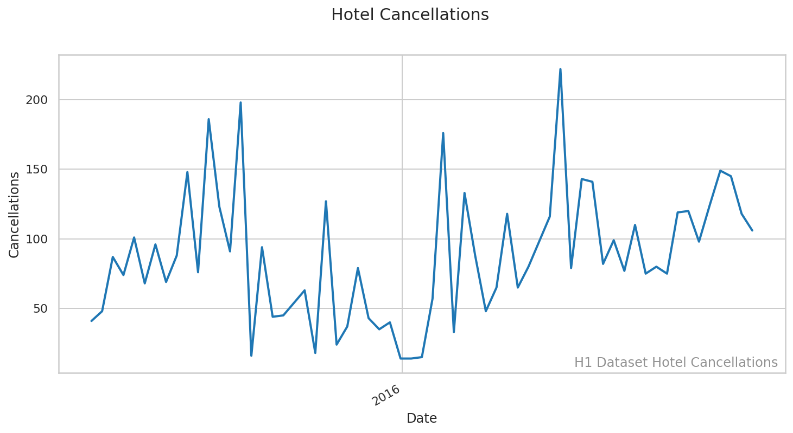
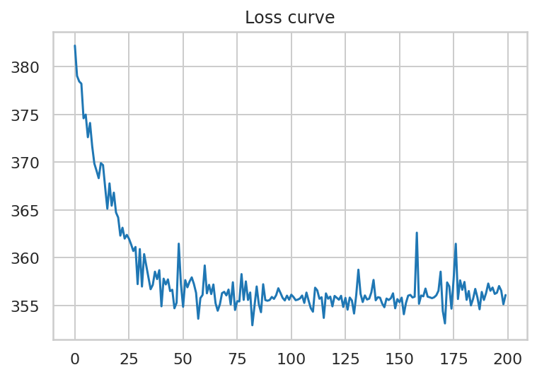
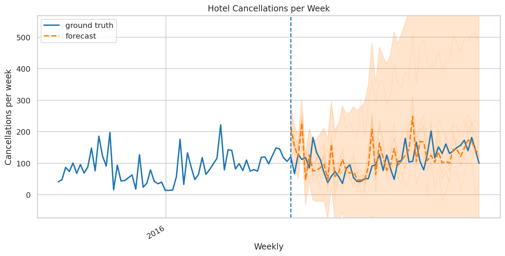
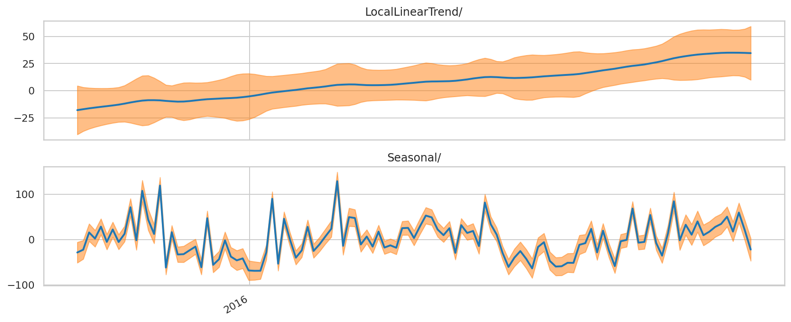
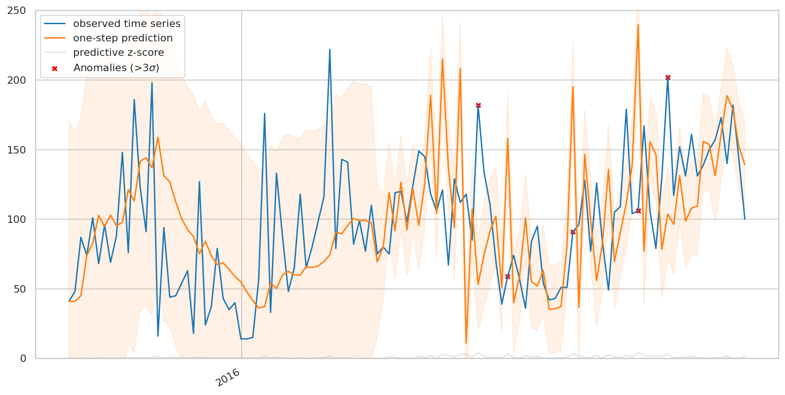

[Home](https://mgcodesandstats.github.io/) |
[GitHub](https://github.com/mgcodesandstats) |
[Speaking Engagements](https://mgcodesandstats.github.io/speaking-engagements/) |
[Terms](https://mgcodesandstats.github.io/terms/) |
[E-mail](mailto:contact@michael-grogan.com)

# TensorFlow Probabilty: Predicting Weekly Hotel Cancellations with Structural Time Series Modelling

The TensorFlow probability library allows for detailed data analysis using statistics and probability methodologies. In addition, this library is also quite effective at time series forecasting.

In this instance, a structural time series model is created with TensorFlow Probability in order to forecast weekly hotel cancellation incidences.

The examples illustrated in this article use the template from the template from the [Structural Time Series modeling](https://blog.tensorflow.org/2019/03/structural-time-series-modeling-in.html) in TensorFlow Probability tutorial, of which the original authors (Copyright 2019 The TensorFlow Authors) have made available under the Apache 2.0 license.

## Background

Cancellations from the H1 dataset are analysed on a weekly basis (i.e. the number of cancellations for a given week are summed up).

Firstly, data manipulation procedures were carried out using pandas to sum up the number of cancellations per week and order them correctly.

The idea behind using TensorFlow probability is to generate a forecast distribution - rather than a single forecast.

This is quite useful from the standpoint of allowing a business to generate a scenario analysis. For instance, COVID-19 resulted in the vast majority of hotel bookings being cancelled. Even the forecasts made by this model could never have predicted such a "black swan" event and therefore would not be of use in making future forecasts.

However, TensorFlow probability does allow for an analysis of what forecasts at the extreme end of the probability distribution look like, e.g. the top and bottom 5% of forecasts made.

Functions are defined for **forecast plotting**, **posterior component plotting**, and **one-step prediction**. The details of these are available in the Jupyter Notebook as referenced below.

For reference, a **posterior** probability distribution refers to a distribution whereby a probability of an event happening is assigned after relevant evidence (i.e. posterior data) is taken into account. In essence, the model is generating a probability distribution for hotel cancellations by using the prior posterior data as the available evidence.

## Data Processing

A model is fit to split the series into training and test data on a weekly basis.

```
num_forecast_steps = 1 * 52
tseries_training_data = tseries[:-num_forecast_steps]

tseries_dates = np.arange("2015-06-15", "2017-08-27", dtype="datetime64[W]")
tseries_loc = mdates.YearLocator(3)
tseries_fmt = mdates.DateFormatter('%Y')
```

Here is a plot of the weekly hotel cancellation incidences:



## Model Fitting

The model is fitted with a local linear trend, along with a weekly seasonal effect (num_seasons=52).

```
def build_model(observed_time_series):
  trend = sts.LocalLinearTrend(observed_time_series=observed_time_series)
  seasonal = tfp.sts.Seasonal(
      num_seasons=52, observed_time_series=observed_time_series)
  model = sts.Sum([trend, seasonal], observed_time_series=observed_time_series)
  return model
```

The objective behind the building of this model is to fit a sample of posterior distributions for the parameters in question. This is done using variational inference - with the aim of minimizing the variational loss function.

A set of samples from the variational posterior is drawn:

```
tseries_model = build_model(tseries_training_data)

# Build the variational surrogate posteriors `qs`.
variational_posteriors = tfp.sts.build_factored_surrogate_posterior(
    model=tseries_model)
```

Here is the loss curve showing a minimization of the variational loss:

 

## Forecasting

A forecast is now constructed with the fitted model using ```tfp.sts.forecast```. This returns a distribution which illustrates the predictive distribution over subsequent timesteps.

```
tseries_forecast_dist = tfp.sts.forecast(
    model=tseries_model,
    observed_time_series=tseries_training_data,
    parameter_samples=q_samples_tseries_,
    num_steps_forecast=num_forecast_steps)
```

Additionally, the mean and standard deviation is calculated to quantify the uncertainty of each prediction at a particular timestep.

```
num_samples=10

tseries_forecast_mean, tseries_forecast_scale, tseries_forecast_samples = (
    tseries_forecast_dist.mean().numpy()[..., 0],
    tseries_forecast_dist.stddev().numpy()[..., 0],
    tseries_forecast_dist.sample(num_samples).numpy()[..., 0])
```



Here is a breakdown of the linear trend and seasonal component:



Here is a graph of the one-step prediction, with anomalies (or observations greater than three standard deviations from the mean) illustrated:



Some noteworthy points from looking at this analysis:

1. For the one-step prediction, more anomalies are indicated on the latter part (right-hand side) of the graph. Additionally, it is notable that the size of the distribution is narrower than that of the left, which indicates that there was less volatility in weekly hotel cancellation incidences during this period.

2. When examining the forecast, we see that the peaks of the forecasts are slightly higher than the actual series. This implies that the forecast is carrying forward higher volatility from the previous cancellation incidences.

3. The forecast distribution is quite wide, with weekly cancellations potentially exceeding 500 - much greater than the range of approximately 50 to 200 as indicated by the graph. From this standpoint, a hotel could use such information in conducting a "worst-case scenario", e.g. the hotel could have in excess of 500 cancellations in a given week under an extreme case. As previously mentioned, this forecast in itself does not account for a "black swan" scenario such as COVID-19 where a hotel would need to close outright - but it is evident that a probability forecast is more informative than a standard forecast in its own right.

## Conclusion

This has been an introduction to Structural Time Series Modelling with TensorFlow Probability.

You have seen:

- How a posterior probability distribution can be used to generate forecasts

- How to minimise the variational loss when generating forecasts

- Screening for anomalies using one-step predictions

Many thanks for reading, and the GitHub repository for this project with associated code can be found [here](https://github.com/MGCodesandStats/hotel-modelling).

## References

- [Antonio, Almeida, and Nunes: Using Data Science to Predict Hotel Booking Cancellations](https://www.researchgate.net/publication/309379684_Using_Data_Science_to_Predict_Hotel_Booking_Cancellations)

- [TensorFlow Blog: Structural Time Series modeling](https://blog.tensorflow.org/2019/03/structural-time-series-modeling-in.html)