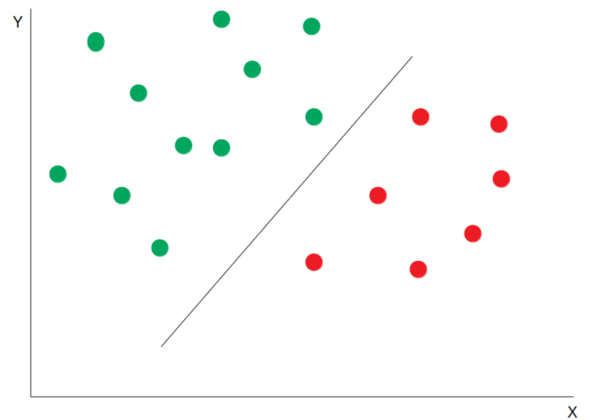

[Home](https://mgcodesandstats.github.io/) |
[Medium](https://medium.com/@firstclassanalyticsmg) |
[LinkedIn](https://www.linkedin.com/in/michaeljgrogan/) |
[GitHub](https://github.com/mgcodesandstats) |
[Speaking Engagements](https://mgcodesandstats.github.io/speaking-engagements/) |
[Terms](https://mgcodesandstats.github.io/terms/) |
[E-mail](mailto:contact@michael-grogan.com)

# Unausgeglichene Klassen: Vorhersage von Hotelstornierungen mit Support Vector Machines

*This is a translated summary of the original article (in my best German!): [Imbalanced Classes: Predicting Hotel Cancellations with Support Vector Machines](https://www.michael-grogan.com/hotel-modelling/articles/unbalanced_svm)*

Unausgeglichene Klassen können Probleme verursachen wenn man Daten analysieren will. Warum?

Eine unausgeglichene Klasse verursacht eine Situation, in der das Modell die Hauptklasse stärker in den Vordergrund stellt.

In diesem Beispiel benutzt man eine Support Vector Machine um zu vorhersagen ob ein Kunde seine Hotelbuchung storniert oder nicht.

Stornierungen sind die Nebenklasse. Nichtstornierungen sind die Hauptklasse.

Im Modell werden folgende Funktionen verwendet:

- Lead time
- Country of origin
- Market segment
- Deposit type
- Customer type
- Required car parking spaces
- Arrival Date: Year
- Arrival Date: Month
- Arrival Date: Week Number
- Arrival Date: Day of Month

## Was ist SVM?

SVM (Support Vector Machines) ist eine mathematisches Modell für betreute Lernzwecke.

Dieses Modell wird sowohl für Klassifizierungs- als auch für Regressionsaufgaben verwendet.

Das SVM-Modell ermöglicht eine Beurteilung, wie wichtig jeder Trainingspunkt für die Definition der Entscheidungsgrenze zwischen den beiden Klassen ist.



Die wenigen ausgewählten Trainingspunkte, die an der Entscheidungsgrenze zwischen den beiden Klassen liegen, werden als Unterstützungsvektoren bezeichnet.

## "Precision" (präzision) gegen "Recall" und f1-score

**Precision** und **Recall** werden wie folgt berechnet:

```
Precision = ((Wahrhaft Positiv)/(Wahrhaft Positiv + Falsch Positiv))

Recall = ((Wahrhaft Positiv)/(Wahrhaft Positiv + Falsch Negativ))
```

Normalerweise führt eine Zunahme von Präzision zu einer Abnahme von Recall, und umgekehrt.

Welches ist das wichtigste in dieser Situation?

Im Allgemeinen, man würde ein falsches Positiv bevorzugen, da es dem Hotelmanager ermöglicht, zu erkennen, ob ein Kunde ein Stornierungsrisiko darstellt.

## SVM und Unausgeglichene Klassen

Die Daten werden in Training und Validation aufgeteilt, und das Modell wird auf dem H1-Datensatz trainiert.

Das 'class_weight' ist auf 'balanced' eingestellt. Dies bedeutet, dass Fehler in der Nebenklasse stärker bestraft werden.

```
y1 = y
x1 = np.column_stack((leadtime,countrycat,marketsegmentcat,deposittypecat,customertypecat,rcps,arrivaldateyear,arrivaldatemonthcat,arrivaldateweekno,arrivaldatedayofmonth))
x1 = sm.add_constant(x1, prepend=True)

x1_train, x1_val, y1_train, y1_val = train_test_split(x1, y1, random_state=0)

from sklearn import svm
clf = svm.SVC(gamma='scale', 
            class_weight='balanced')
clf.fit(x1_train, y1_train)  
prclf = clf.predict(x1_val)
prclf
```

Hier sind die Ergebnisse für den Validierungssatz:

```
[[5142 2124]
 [ 865 1884]]
              precision    recall  f1-score   support

           0       0.86      0.71      0.77      7266
           1       0.47      0.69      0.56      2749

    accuracy                           0.70     10015
   macro avg       0.66      0.70      0.67     10015
weighted avg       0.75      0.70      0.72     10015
```

Hier sind die Ergebnisse für den H2-Datensatz:

```
[[25217 21011]
 [ 8436 24666]]
              precision    recall  f1-score   support

           0       0.75      0.55      0.63     46228
           1       0.54      0.75      0.63     33102

    accuracy                           0.63     79330
   macro avg       0.64      0.65      0.63     79330
weighted avg       0.66      0.63      0.63     79330
```

Für den H2-Datensatz, die f1-Score accuracy ist auf 63% gesunken, aber der Recall jedoch auf 75%.

Mit anderen Worten, 75% aller Kunden, die ihre Hotelbuchung stornieren, werden korrekt identifiziert.

## Schlussfolgerung und Referenzen

In diesem Beispiel man hat gesehen, wie man kann eine Support Vector Machine für Klassifizierungszwecke verwendet, und die wichtige Unterschiede zwischen Präzision und Recall.

Die Datensätze und Notizbücher sind verfügbar hier: [MGCodesandStats GitHub Repository](https://github.com/MGCodesandStats/hotel-modelling).

Eine weitere nützliche Referenz: [Elite Data Science: How to Handle Imbalanced Classes in Machine Learning](https://elitedatascience.com/imbalanced-classes)